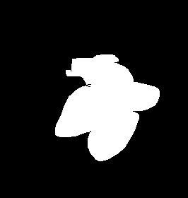

# Morphological Noise removal
Opencv approach for morphological noise removal
# Dependancies
1.Python  
2.OpenCV Library  
3.Matplotlib Library  

# Working
Noise Removal with morphological approach
In this part we define a 5 by 5 kernal using np array. Then dilation and erosion is done by using a predefined functions dilate() and erode() in OpenCV library. For Opening and closing a functoin called morphologyEX() by changing its attributes.

# Run the code
    python morphological_noise.py

**Input image**

**Output image**
